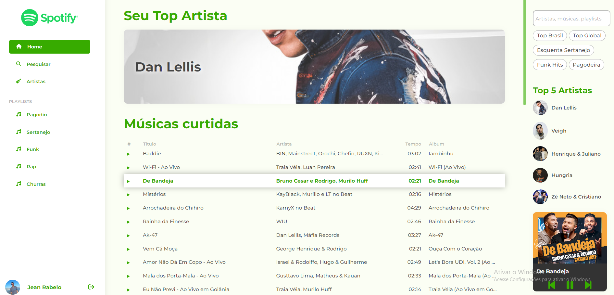

# 👽 SPOTIFY CLONE

Plataforma Angular de clone e redesign do Spotify, utilizando a API disponilizada pelo Spotify para desenvolvedores. Através desta
API é possível vincular esta plataforma diretamente com a sua conta do Spotify, possibilitando a integração com principais playlists, músicas e artistas favoritos
entre outras informações vinculadas a sua conta.


## 🚀 Ambiente de desenvolvimento

O código fonte se encontra no repositório do Github:

https://github.com/jeancrrg/Spotify-Clone-Angular.git

## 💻 Tecnologias utilizadas

>Html → Linguagem de marcação de Hipertexto

>Scss → Folha de estilo dos componentes

>Typescript → Linguagem de programação

>Angular 16 → Framework

>Node 20.14.10 → Framework

>Npm 10.7.0 → Gerenciador de pacotes do Node

>API do Spotify → API disponibilizada para desenvolvedores

## 📝 Requisitos

>Versão 16 do Angular

>Versão do Node compatível a versão do Angular

>Conta Premium do Spotify

Para poder utilizar a plataforma é necessário que o usuário possua uma conta Premium no Spotify para que seja feita a conexão com o mesmo de forma corretamente.

## 🛠️ Como rodar o projeto

Ao importar o projeto, antes de subir localmente é necessário instalar as bibliotecas do projeto, para isso basta executar o seguinte comando no terminal:

```properties
npm install
```

Logo após a instalação das bibliotecas basta executar o seguinte comando para subir localmente:

```properties
npm start
```

Feito isso, abra o projeto no navegador:

```properties
http://localhost:4200/
```

## ⚙️ Como executar os testes

Os testes são criados usando as bibliotecas Jasmine e Karma propriamente do Angular. 
Para executar os testes basta rodar o seguinte comando no terminal:

```properties
npm test
```

Ao rodar esse comando será aberto uma nova janela onde serão rodados os testes criados.

## 📌 Sobre a plataforma

A plataforma foi desenvolvida pensando nos mínimos detalhes para os amantes da música. Com seu layout bastante intuitivo é bem fácil navegar pela vasta biblioteca musical com apenas alguns cliques. Esta plataforma realiza integrações diretamente com a conta do Spotify através de uma API liberada para desenvolvedores, ou seja, todas as playlists, músicas e artistas favoritos do Spotify estarão aqui. 


